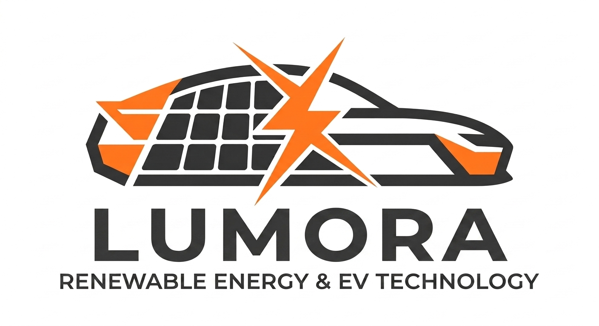

# ☀️ Lumora — Website Oficial

<p align="center">
  
</p>

<p align="center">
  <strong>Transformando o mundo através do poder da energia limpa e renovável.</strong><br>
  Tecnologia de ponta convertendo luz natural em autonomia para a mobilidade elétrica.
</p>

<p align="center">
  
  
  
  
</p>

---

## 📌 Sobre o Projeto

Este repositório contém o código-fonte do website institucional da **Lumora**, uma empresa inovadora fundada em Berlim (Alemanha) focada em integrar energia solar de alta performance à mobilidade elétrica. O projeto foi desenvolvido com foco em performance, semântica estrutural e design adaptável para múltiplos dispositivos.

O produto principal destacado na página é o **Kit de Engenharia Solar Híbrida**, projetado sob medida para o teto solar original de veículos elétricos (EVs), promovendo recarga inteligente e redução de custos operacionais de frotas.

## 🚀 Funcionalidades Integradas

- **Navegação Inteligente & Fluida:** Âncoras de navegação direta para transição suave entre seções.
- **Design Totalmente Responsivo:** 
  - **Desktop/Tablet:** Menu lateral moderno com identidade visual marcante (`#fd5202`).
  - **Mobile:** Barra superior perfeitamente compactada com distribuição matemática exata (`display: table-cell`), garantindo usabilidade tanto em Android quanto em iOS.
- **Seção de FAQ Dinâmica:** Central de dúvidas estruturada para esclarecimento de aspectos técnicos e comerciais sobre o produto.
- **Formulário de Contato:** Estrutura semântica pronta para envio de mensagens corporativas.

## 🛠️ Tecnologias Utilizadas

- **HTML5** — Estruturação semântica do conteúdo.
- **CSS3** — Customizações de layout, tipografia e regras de mídia (`@media`).
- **W3.CSS** — Framework CSS ágil e responsivo para alinhamento e componentes visuais.
- **Font Awesome 4.7** — Biblioteca de ícones vetoriais.
- **Google Fonts (Montserrat)** — Tipografia moderna com foco em leitura digital.

## 🎨 Layout e Visual

O design adota uma estética *Dark Mode* sofisticada com contrastes em tons de ciano (`#00bcd4`) e laranja vibrante para destacar a inovação energética, garantindo leitura agradável e apelo tecnológico.

## 📂 Estrutura de Arquivos

```text
├── index.html        # Página principal do website
├── style.css         # Estilizações customizadas adicionais
├── logotipo.png      # Identidade visual da Lumora
├── kit.png           # Imagem técnica da arquitetura do kit
├── TUV.jpg           # Logotipo da homologação TUV Rheinland
├── UL.jpg            # Logotipo da homologação UL Solutions
├── IEC.jfif          # Logotipo da homologação IEC
└── UNECE.jfif        # Logotipo da homologação UNECE WP.29
